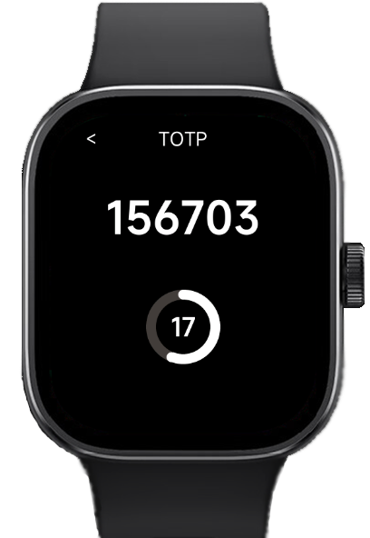

# 레드미워치 OTP앱

###
###
## 0. 들어가기에 앞서
- 해당 앱은 레드미워치5 이상 모델부터 사용 가능합니다.
- 해당 앱을 시계에 설치함으로써 발생하는 기기 오작동 및 모든 불이익에 대해 개발자는 책임을 지지 않습니다.

###
###
## 1. 설치방법
### 1.1. release탭의 최신버전 rpk 파일을 휴대폰에 받아주세요.

### 1.2. Notify for Xiaomi 앱을 설치해주세요.
- 해당앱의 지시를 따라 시계를 연결하세요

### 1.3. 장치 - 펌웨어업데이트 - 타사 앱(rpk) 항목으로 들어가 1.1.에서 받은 rpk파일을 설치해주세요

### 1.4. 설치 완료 후엔 휴대전화 설정에서 Notify for Xiaomi앱의 근처기기 권한을 회수하고 Mi Fitness 앱과 워치를 연결해주세요
- 해당 앱은 Mi Fitness앱을 통해 통신하기 때문에 Notify 앱과 연결되어있으면 otp 추가가 불가능합니다.
- 반드시 Mi Fitness 앱과 연결해주세요.

###
###
## 2. 삭제방법
- 워치 내의 앱 목록에서 앱을 길게 눌러 삭제해주세요

###
###
## 3. OTP 셋팅방법
### 3.1. 시계 앱에서 +버튼을 누른 후 나온 qr코드를 폰으로 인식하여 웹페이지를 엽니다.

### 3.2. 이름, 시크릿키, 타임아웃(기본30초)을 입력하고 전송버튼을 누릅니다.

### 3.3. 시계 앱에서 Touch here to save after submit in the web 버튼을 누릅니다.

### 3.4. 시계 앱에 입력한 otp정보가 저장됩니다.

###
###
## 4. 기타정보
- 위 앱은 샤오미 vela 프레임워크로 개발되었습니다 : https://iot.mi.com/vela/quickapp